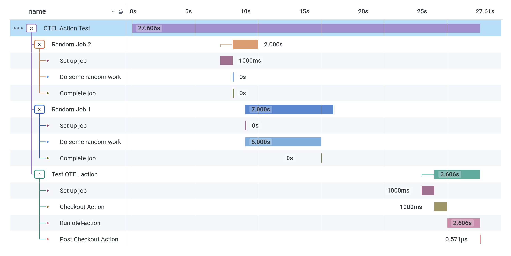

<h1 align="center">
    <br>
        OpenTelemetry Action
    <br>
</h1>
<h4 align="center">
    Upload OpenTelemetry traces of a GitHub actions workflow run
</h4>
<p align="center">
    <a href="https://github.com/MNThomson/otel-action/commits">
        
    </a>
</p>


---

## About

Running `otel-action` at the end of a GitHub workflow will upload [OpenTelemetry](https://opentelemetry.io/) spans for each job (and job step) to an OTel compatible endpoint. This provides observability into CI pipelines, and provides a quick method to find offending commits that are the root cause of a CI job becoming slower.

Below is an example trace from this repository's [test workflow](.github/workflows/test.yml) being viewed in [Honeycomb.io](https://www.honeycomb.io/)'s UI (they have an awesome free-forever tier)!

<p align="center">
    
</p>

## Example usage

```yaml
- name: Upload OTEL traces
  uses: MNThomson/otel-action@master
  with:
    endpoint: ${{ secrets.ENDPOINT }}
    headers: ${{ secrets.HEADERS }}
    service_name: "MyDatasetName"
```
